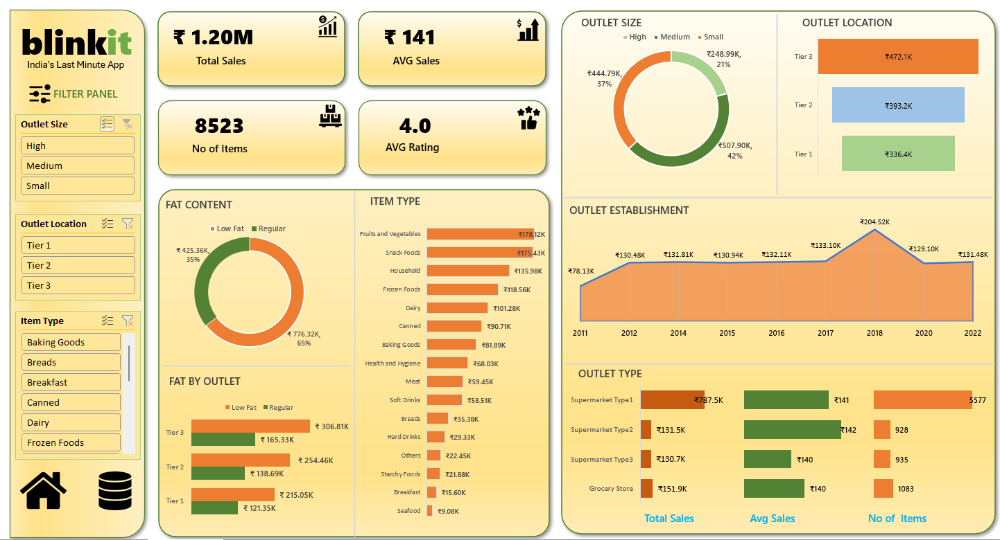

# Blinkit Sales Analysis Project 📊

## Project Overview 🚀  
This project analyzes Blinkit sales data to extract insights, identify trends, and create impactful dashboards using **Excel**.  

## Tools Used 🛠  
- **Microsoft Excel**: Data cleaning, analysis, and visualization.  
- **PowerPoint**: Presentation of insights and results.  

## Key Insights 📈  
- **Total Sales**: ₹1.20M  
- **Average Rating**: 4.0 ⭐  
- **Top Outlet Performance** by Size, Location, and Establishment Year  
- **Item Analysis**: Fruits, Vegetables, and Snacks lead in sales.  

## Visuals 🖼  
- Interactive dashboards were created in Excel to visualize:  
  - **Outlet Size and Location Trends**  
  - **Item Type Performance**  
  - **Sales Over the Years**  
  - **Fat Content Impact** on Sales  

## Why This Project? 💡  
- To improve my **data analysis skills**.  
- To showcase how Excel can be used for data-driven decision-making.  
- To create impactful visualizations that communicate insights effectively.  

## Learning Outcomes 🌟  
- Advanced Excel skills: Pivot Tables, Charts, Data Visualization  
- Storytelling through data: Turning raw data into actionable insights  
- Dashboard development for business analysis  

## Future Enhancements 🔮  
- Adding Power BI visualizations for advanced interactivity.  
- Automating some data processes using Python.  

## Connect With Me 🔗  
- [LinkedIn Profile](#)  
- [GitHub Profile](#)  

